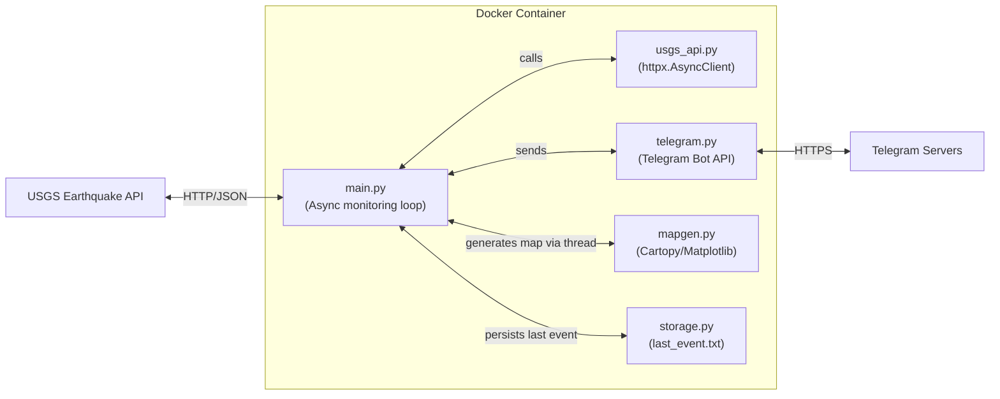

# USGS Telegram Earthquake Alert Service

---

## Project Overview

This project provides a lightweight, Dockerized Python service that continuously monitors earthquake activity worldwide using the [USGS Earthquake API](https://earthquake.usgs.gov/). When an earthquake event occurs within 2,500 km of Bangkok, Thailand, and meets the configured minimum magnitude (default ≥ 4.0), the service sends real-time alerts directly to a Telegram chat, including annotated map images for enhanced situational awareness.

The service is designed for users who want timely earthquake notifications without manual monitoring, combining asynchronous programming for efficiency, geospatial visualization with Cartopy, and seamless Telegram bot integration. It is containerized for easy deployment and scalability.

---

## For Users

### Features

- Asynchronous polling of the USGS Earthquake API with configurable intervals.
- Geodesic distance calculation to filter earthquakes within a 2,500 km radius of Bangkok.
- Real-time Telegram alerts for earthquakes meeting a configurable minimum magnitude (default ≥ 4.0).
- Annotated map images showing epicenter, Bangkok location, and distance.
- Duplicate event detection to avoid repeated alerts.
- High-performance event loop using `uvloop`.
- Dockerized for simple deployment and persistent storage of processed event IDs.

### Prerequisites

- A Telegram bot token (create via [BotFather](https://t.me/BotFather)).
- Your Telegram chat ID (message your bot once and retrieve it).
- Docker and Docker Compose installed on your machine.

### Setup Instructions

1. **Clone the repository**

```bash
git clone https://github.com/Thammaros/usgs-telegram-alerts.git
cd usgs-telegram-alerts
```

2. **Configure environment variables**

Create a `.env` file in the root directory or export variables directly:

```bash
TELEGRAM_BOT_TOKEN="your_bot_token_here"
TELEGRAM_CHAT_ID="your_chat_id_here"
FETCH_INTERVAL_SECONDS=15
```

3. **Run the service with Docker Compose**

```bash
docker compose up -d --build
```

This will build the container, mount volumes for persistent cache files, and start the monitoring service in the background.

### Example `.env` Configuration

```env
TELEGRAM_BOT_TOKEN=123456789:ABCDEFGHIJKLMNOPQRSTUVWXYZ
TELEGRAM_CHAT_ID=987654321
FETCH_INTERVAL_SECONDS=15
```

### Example Output


*The alert includes an annotated map pinpointing the earthquake epicenter, a marker for Bangkok, and a label showing the distance between them, along with detailed earthquake information in Thai.*

### Stopping and Cleaning Up

To stop the service and remove containers and volumes:

```bash
docker compose down -v
```

---

## For Developers

### Project Structure

```
.
├── docker-compose.yaml     # Docker orchestration and service definition
├── deploy.sh               # Optional deployment helper script
└── app/
    ├── main.py             # Core monitoring loop and event handling
    ├── config.py           # Configuration variables and constants
    ├── mapgen.py           # Map generation using Cartopy
    ├── storage.py          # Persistent storage for event and chat IDs
    ├── telegram.py         # Telegram bot API integration
    ├── usgs_api.py         # USGS Earthquake API client
    ├── logger.py           # Logging setup and configuration
    ├── requirements.txt    # Python package dependencies
    └── Dockerfile          # Alpine-based Docker image build instructions
```

### Local Development

1. **Create and activate a Python virtual environment**

```bash
python3 -m venv venv
source venv/bin/activate
```

2. **Install dependencies**

```bash
pip install -r app/requirements.txt
```

3. **Set environment variables**

Set `TELEGRAM_BOT_TOKEN` and `TELEGRAM_CHAT_ID` in your terminal or `.env` file.

4. **Run the service locally**

```bash
python app/main.py
```

### Testing

- Unit tests can be added in a `tests/` directory (not currently included).
- Test modules individually by running them or importing functions interactively.
- Mock external API calls (USGS, Telegram) during testing to avoid real requests.

### Code Style and Contributions

- Follow PEP8 Python style guidelines.
- Use meaningful variable and function names.
- Write docstrings for functions and classes.
- Submit pull requests with clear descriptions and related issue references.
- Run tests and lint checks before submitting PRs.

### CI/CD Workflow

- The project uses GitHub Actions for continuous integration.
- On push or pull request, workflows run linting, tests, and build Docker images.
- Deployments can be automated via the `deploy.sh` script or GitHub Actions.

---

## System Architecture



- `main.py` orchestrates fetching earthquake data, filtering events, generating maps, and sending Telegram alerts.
- `usgs_api.py` handles USGS API requests asynchronously.
- `telegram.py` sends messages and images via Telegram Bot API using an env-configured chat ID.
- `mapgen.py` creates annotated maps using Cartopy.
- `storage.py` persists the last processed event IDs (no chat ID caching).

- The entire service runs inside a lightweight Alpine-based Docker container managed via Docker Compose.

---

## License

This project is licensed under the MIT License. See the [`LICENSE`](./LICENSE) file for details.

---

## Acknowledgements

- [USGS Earthquake API](https://earthquake.usgs.gov/)
- [Telegram Bot API](https://core.telegram.org/bots/api)
- [Cartopy](https://scitools.org.uk/cartopy/)
- [uvloop](https://github.com/MagicStack/uvloop)
- [httpx](https://www.python-httpx.org/)

---

## Author

Maintained by [Thammaros](https://github.com/Thammaros)
